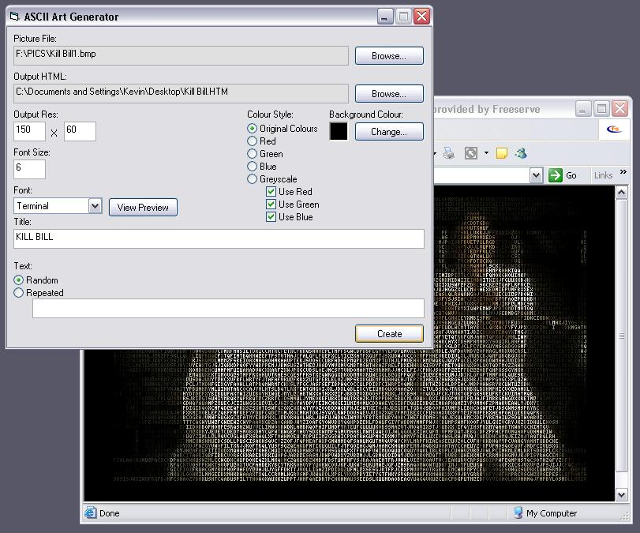



## ASCII Art Html Generator

### Description

This program will take a picture and convert it to ASCII art, so that it can be shown in a html page. When converting a picture you can adjust what dimensions of the output you want, what size and font to use, you can alter the colouring and also the text that is used to render the picture. Included is an example of what a generated picture will look like.
 
### More Info
 

             |
---                |---
**Submitted On**   |2004-01-03 19:56:02
**By**             |[Kevin Pfister](https://github.com/Planet-Source-Code/PSCIndex/blob/master/ByAuthor/kevin-pfister.md)
**Level**          |Intermediate
**User Rating**    |5.0 (35 globes from 7 users)
**Compatibility**  |VB 6\.0
**Category**       |[Graphics](https://github.com/Planet-Source-Code/PSCIndex/blob/master/ByCategory/graphics__1-46.md)
**World**          |[Visual Basic](https://github.com/Planet-Source-Code/PSCIndex/blob/master/ByWorld/visual-basic.md)
**Archive File**   |[ASCII\_Art\_169009132004\.zip](https://github.com/Planet-Source-Code/kevin-pfister-ascii-art-html-generator__1-50766/archive/master.zip)

